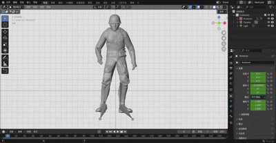
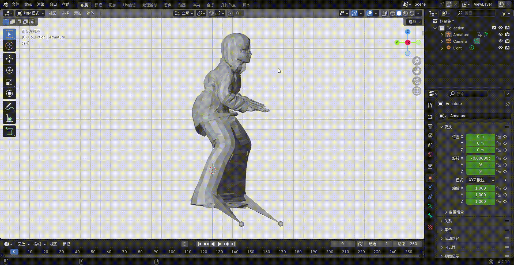
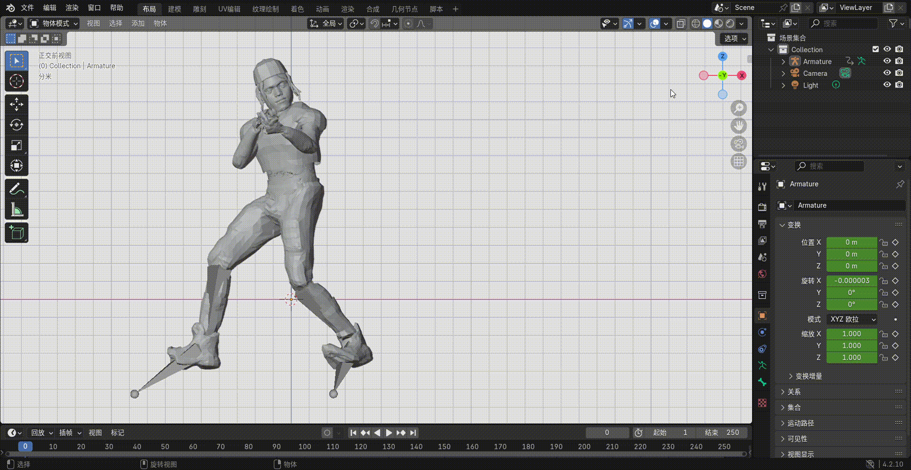

# jittor-comp-human

## 1. 团队信息  
**队名**：赛博骨骼  
**B榜排名**：5  

### 联系人及联系方式  
- 李祥：17561841398 | QQ: 1739781578  
- 李志硕：13255347886 | QQ: 957379331  
- 蒋金辰：19017322371 | QQ: 2530975434  


## 2. 核心目标与项目概述  
### 任务目标  
通过训练一批3D人体网格模型以及对应的joint位置、skin权重，使得3D神经网络实现对任意人体模型的joint节点的空间位置预测以及skin权重预测。


### 解决思路  
将任务分为预测joints和预测skin为两个阶段，将数据集分为T-pose与其他pose，vroid和mixamo分别进行处理。
#### 1. 数据集划分  
- **按来源划分**：将Mixamo和Vroid数据集分离，避免数据分布差异干扰模型训练。  
- **按姿态划分**：将T-pose（标准姿态）与其他pose（动态姿态）分离，针对性训练。

训练skin过程中，我们将数据集分为进行了mixamo和vroid两类，训练joint过程中，将数据集分为了T-pose-mixamo，Pose-mixamo，T-pose-vroid，Pose-vroid。

#### 2. 蒙皮权重预测优化  
直接建立点云到蒙皮权重的映射，避免引入关节预测误差对蒙皮权重的影响。  

#### 3. 模型架构改进  
- **PCT2模型**：将Pointtransformer1换为PCT2模型对点云进行编码。PCT模型中的SG层，根据KNN算法筛选除点云及其邻居节点，并对其特征分组进行整合，最终在三维点云中实现类似卷积层的效果，从而提高模型精度。 
- **PCAE模型**：在训练joints时，T-pose-mixamo，Pose-mixamo，T-pose-vroid三类数据使用PCT2模型进行预测，Pose-vroid则构建了PCAE模型进行训练。该模型通过可学习的嵌入向量和自注意力层来显式地建模关节之间的层级关系，并利用特殊的嵌入层和变换MLP来高精度地处理3D坐标与旋转表示，能应对具有特殊pose的点云模型。  

#### 4. 数据处理优化  
- **朝向转正**：统一测试数据朝向，提升关节预测准确度。  
- **采样点增强**：将采样点数量从1024提升至2048，强化点云特征学习。  
- **随机种子固定**：确保训练过程可复现。  

#### 5. 数据增强与训练策略  
- **预处理数据增强**：由于原始dataloader中计算随机pose变换时非常耗时，我们对数据增强进行了预处理，构建了1512个变换pose的数据集。 它基于track目录下的10个动画和random pose，构建了新的训练数据集和验证数据集，增强模型对不同pose模型的处理能力，同时提高训练效率。1512个变换pose中有1000个是随机pose， 512个来自track 目录中的pose。  
- **增量式训练**：由于模型训练速度较慢，对于ID大于10000的点云模型，我们在基于1000个random pose训练得到best model 之后，基于best model 引入track pose进行增量式训练，以提升对一些特殊pose的骨骼生成能力。  


### 阶段具体方法  
#### 数据增强阶段  
- 基于random pose和track目录中的10个动画pose进行数据增强，生成具有更多pose的数据集，用于后续的训练。该部分通过通过生成随机或对track中动画文件中按帧截取来获取pose，将得到的pose应用于有T-pose模型后，得到一个有更多pose的数据集。  

#### 关节训练阶段  
- **T-pose-mixamo，Pose-mixamo，T-pose-vroid数据**：使用PointCouldTransformer  将输入的形状为(batch, n, 3)的三维点云变成了形状为(batch, feat_dim)的隐向量，之后通过一个MLP得到形状为(batch, 66)的输出（66=3*22，22为固定的joint个数），通过reshape操作便得到了最终预测的joint。  
- **Pose-vroid数据**：使用PCAE模型，输入形状为形状为(batch, n, 3)的三维点云,通过点云嵌入提取特征，通过FPS算法进行采样，然后通过交叉注意力机制生成latent，然后传入自注意力层精炼特征，然后通过解码器的交叉注意力机制，与可学习的joint embedding进行融合，最终得出预测结果。 

#### 蒙皮训练阶段  
- 使用PointCouldTransformer  将输入的形状为(batch, n, 3)的三维点云变成了形状为(batch, feat_dim)的latent。之后latent通过一个MLP得到形状为(batch, 22,3)的joint矩阵，然后将joint和latent输入到MLP中得到一个joints_latent  ,其形状为(batch, 22,feat_dim)。latent再与三维点云一起输入到一个MLP中,得到另一个形状为(batch, n,feat_dim)的vertices_latent。根据得到了joints_latent和vertices_latent得到形状为(batch, n,22)的skin预测结果。

#### 数据预处理与后处理阶段  
- 在预测test的joint的时候，其中一些朝向较偏的数据进行了转正。在对test数据集进行预测前，将其转正，并在得到转正的预测结果之后，将该结果转回原来的朝向，得到最终的位置。


## 3. 环境配置  
环境配置与官方提供的Baseline仓库的环境一致，没有安装其他任何依赖。
### 依赖环境  
- **系统**：Ubuntu 22.04.1  
- **CUDA**：12.5（驱动版本555.42.02）  
- **Python**：3.9  
- **GCC/G++**：≤10  

### 配置指令  
```bash
# 创建虚拟环境
conda create -n jittor_comp_human python=3.9
conda activate jittor_comp_human

# 安装编译工具
conda install -c conda-forge gcc=10 gxx=10 

# 安装依赖
pip install -r requirements.txt
```

### 依赖版本  
| 模块         | 版本       |  
|--------------|------------|  
| jittor       | 1.3.9.14   |  
| numpy        | 1.26.4     |  
| trimesh      | 4.7.1      |  
| scipy        | 1.13.1     |  
| matplotlib   | 3.9.4      |  

## 4. 训练与测试步骤  
### 4.1 数据增强  
#### 基于随机pose  
```bash
python gen_random_pose_train_batch.py --cls mixamo --total_workers 2 --worker_id 0
python gen_random_pose_train_batch.py --cls mixamo --total_workers 2 --worker_id 1
python gen_random_pose_train_batch.py --cls vroid --total_workers 2 --worker_id 0
python gen_random_pose_train_batch.py --cls vroid --total_workers 2 --worker_id 1
```
#### 基于track pose
```bash
python gen_track_pose_train_batch.py --cls mixamo --total_workers 2 --worker_id 0
python gen_track_pose_train_batch.py --cls mixamo --total_workers 2 --worker_id 1
python gen_track_pose_train_batch.py --cls vroid --total_workers 2 --worker_id 0
python gen_track_pose_train_batch.py --cls vroid --total_workers 2 --worker_id 1
```
数据增强的运行结果会显示在data/train目录中，生成例如mixamo-1001的目录，目录中为每一个T-pose模型的对应pose变换的npz文件，文件中仅包括vertices和joints两条属性。

### 4.2 蒙皮训练
训练蒙皮均使用dataset.py构建数据集，使用sss.py文件中的PCT2模型：
```bash
# Mixamo数据集  
python train_skin_m.py  # 模型保存于skin_m_4096_1e-5_12000  

# Vroid数据集  
python train_skin_v.py  # 模型保存于skin_v_4096_1e-5_12000+test
```

### 4.3 关节训练
#### T-pose骨骼训练
使用dataset_samllid.py构建数据集，使用skeleton.py文件中的PCT2模型：
```bash
# Mixamo T-pose  
python train_skeleton_m.py  # 模型保存于skeleton_4096_m1e-5_12000  

# Vroid T-pose  
python train_skeleton_v.py  # 模型保存于skeleton_4096_v1e-5_12000
```
#### 其他pose骨骼训练
- Vroid：使用dataset.py构建数据集，skeleton_pcae.py中的 PCAE 模型：
```bash
python train_skeleton_v_pcae.py  # 模型保存于skeleton_pcae_track_1024_m_1e-5_10000  
```
- Mixamo：使用dataset._skeleton.py构建数据集，skeleton.py中的 PCT2 模型：
```bash
python train_skeleton.py  # 模型保存于skeleton_pct2_4096_m1e-4_12000
```

### 4.4 预测关节位置
```bash
python process_test.py  
python p_skeleton_test_v_small_id.py  
python p_skeleton_test_m_small_id.py  
python p_skeleton_test_v_larger_id.py  
python p_skeleton_test_m_larger_id.py  
python post_process.py
```

### 4.5 预测蒙皮权重
```bash
python p_skin_test_m.py  
python p_skin_test_v.py  
python transfer_skin.py  
```
预测结果保存至predict_test文件夹，需确保pretrained_model参数与训练数据集匹配。

### 4.6 参数设置
#### 关节训练和蒙皮训练的主要参数
| 参数名       | 说明       |  
|--------------|------------|  
| model_name       | 选定模型的类别（如 PCT2/PCAE）   |  
| epochs        | 模型的训练轮次     |  
| learning_rate      | 学习率      |  
| weight_decay        | 权重衰减     |  
| data_name   | 训练数据集（mixamo/vroid）      |  
| random_pose   | 数据集中是否包含 pose（1/0）      |  
| sample_num   | 点云采样数量      |   

#### 预测文件的主要参数
| 参数名       | 说明       |  
|--------------|------------|  
| model_name       | 选定模型的类别（如 PCT2/PCAE）   |  
| data_name   | 训练数据集（mixamo/vroid）      |  
| sample_num   | 点云采样数量      |  
| pretrained_model   | 预训练模型路径      |  

## 5. checkpoint说明
### 5.1 关节预测模型参数与指标
#### T-pose模型
| 参数名       | Mixamo T-pose       | Vroid T-pose       |  
|--------------|------------|------------|    
| epochs        | 12000     | 12000     |  
| learning_rate      | 1e-4      | 1e-4      |  
| weight_decay        | 1e-4     | 1e-4      |    
| random_pose   | 0      | 0      |  
| sample_num   | 4096      | 4096      |
| data_name   | mixamo      | vroid      |
| 验证集 J2J_loss   | 0.02567      | 0.00252      |
#### 其他pose模型
| 参数名       | Mixamo（PCT2）       | Vroid（PCAE）       |  
|--------------|------------|------------|    
| epochs        | 12000     | 12000     |  
| learning_rate      | 1e-5      | 1e-4      |  
| weight_decay        | 1e-4     | 1e-5      |    
| random_pose   | 1      | 1      |  
| sample_num   | 4096      | 4096      |
| data_name   | mixamo      | vroid      |
| 验证集 J2J_loss   | 0.06367      | 0.01746      |

### 5.2 蒙皮权重预测模型参数与指标
| 参数名       | Mixamo       | Vroid       |  
|--------------|------------|------------|    
| epochs        | 12000     | 12000     |  
| learning_rate      | 1e-5      | 1e-5      |  
| weight_decay        | 1e-5     | 1e-5      |    
| random_pose   | 0      | 0      |  
| sample_num   | 4096      | 4096      |
| data_name   | mixamo      | vroid      |
| 验证集 skin_l1   | 0.00814      | 0.00167      |

## 6. 资源下载  
### 模型与数据集  
- **网盘链接**：[jittor-data-checkpoint](https://pan.baidu.com/s/14akCMT1ozVxeWT0DhGI08g?pwd=8888)  
- **提取码**：8888  
- **内容说明**：包含预训练的Checkpoint模型文件和数据集，用于复现项目结果。  

### 使用说明  
1. 下载文件后，解压至项目根目录或指定路径。  
2. 预测时需通过`pretrained_model`参数指定模型路径（如`--pretrained_model checkpoint/skin_m/best_model_4645.pkl`）。

## 7. B榜动画结果展示  
为直观体现算法对任意姿态人体模型的关节预测与蒙皮绑定效果，以下是B榜关键动画结果的可视化展示，包含3组代表性动态姿态的渲染动画（对应 Mixamo/Vroid 数据集下不同 ID 的复杂姿态模型）：  



